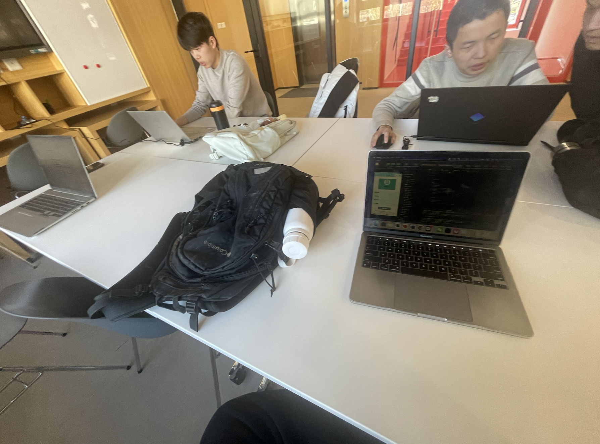

**团队会议纪要**

**
第一次会议
**

* **会议时间**: 2024年10月12日 22：00-23：00
* **会议地点**: 紫荆一号楼412中厅
* **与会人员**: 俞树人、贾云哲、石凯、李扬
* **讨论内容**:
  1. **讨论项目选题**:
     * 初步决定选题方向为智能健康助手，倾向于运动或饮食方面。
     * 决定开发一个微信小程序。
  2. **讨论竞品及目标人群**:
     * 认为竞品是乐动力这样的运动软件，目标人群是注重运动及饮食健康的人群。
  3. **讨论项目核心竞争力**:
     * 要注重运动的社交属性，实现多人共同跑步等功能。

---

**
第二次会议
**

* **会议时间**: 2024年10月28日 22：00-24：00
* **会议地点**: 紫荆一号楼412中厅
* **与会人员**: 俞树人、贾云哲、石凯、李扬
* **讨论内容**:
  1. **讨论中期汇报PPT制作的分工**:
     * 俞树人负责用户与需求分析部分以及PPT展示。
     * 贾云哲负责产品原型设计。
     * 石凯负责总体架构与技术选型部分。
     * 李扬负责背景和目标、开发迭代计划部分。

---

**
第三次会议
**

* **会议时间**: 2024年11月2日 14：00-16：00
* **会议地点**: C楼214B
* **与会人员**: 俞树人、贾云哲、石凯、李扬
* **讨论内容**:
  1. **讨论并重新制定更加合理的开发迭代计划**:
     * 整体将任务的完成时间提前，留出更多时间进行测试及修改。
  2. **明确项目分工**:
     * 贾云哲、石凯负责前端开发。
     * 俞树人、李扬负责后端开发。
  3. **决定先做一个前端的框架**:
     * 登录、注册页面。
     * 接入腾讯地图的跑步页面。

---

**
第四次会议
**

* **会议时间**: 2024年11月9日 10：00-12：00
* **会议地点**: C楼212A
* **与会人员**: 俞树人、贾云哲、石凯、李扬
* **讨论内容**:
  1. **讨论阶段自查表的相关事项**:
     * 确认项目进度与阶段性目标的完成情况。
  2. **商量下一阶段计划**:
     * 决定在前端基础上，使用 Node.js + Express + MongoDB 搭建后端框架。

---

**
第五次会议
**

* **会议时间**: 2024年11月16日 10:00-12:00
* **会议地点**: C楼214B
* **与会人员**: 俞树人、贾云哲、石凯、李扬
* **讨论内容**:
  1. **项目进度汇报**:
     * 各模块开发进度按计划进行，前端和后端的基础功能基本完成。
  2. **规范 Github 使用**:
     * 确保每位成员同步 Github 上主分支，并创建自己的分支进行开发。
  3. **下一步工作计划**:
     * 石凯与贾云哲继续优化前端界面，针对辅导员上次提出的改进建议优化界面设计。
     * 俞树人负责完成后端的登录功能实现。
     * 李扬先写开发报告、代码规范等文档，之后帮助俞树人完成后端开发。

---

**
第六次会议
**

* **会议时间**: 2024年11月23日 10:00-12:00
* **会议地点**: C楼221B
* **与会人员**: 俞树人、贾云哲、石凯、李扬
* **讨论内容**:
  1. **代码设置及API文档整理**:
     * 整理后端API文档，并用 APIFox 进行接口管理。
  2. **后端存储设置**:
     * 完成论坛和其他存储单元的后端设置。
  3. **前后端连接**:
     * 李扬负责实现登录功能，并与其他模块进行接口连接。
  4. **任务管理与团队协作**:
     * 使用 Github Projects 和 Issues 来更好地组织团队任务，确保每个人的任务清晰明确。

---

**
第七次会议
**

* **会议时间**: 2024年12月7日 10:00-12:00
* **会议地点**: C楼213A
* **与会人员**: 俞树人、贾云哲、石凯、李扬
* **讨论内容**:
  1. **跑步数据存储与上传**:
     * 俞树人和石凯负责存储与上传跑步数据。
  2. **登录功能与安全性**:
     * 李扬专注于实现 token 登录验证及安全性功能。
  3. **AI 助手 API 连接**:
     * 贾云哲完成了 AI 助手模块的 API 连接。

---

**
第八次会议
**

* **会议时间**: 2024年12月16日 10:00-12:00
* **会议地点**: 紫荆一号楼412B中厅
* **与会人员**: 俞树人、贾云哲、石凯、李扬
* **讨论内容**:
  1. **讨论完成的工作及剩余任务**:
     * 确定在周三之前完成以下主要功能：
       1. 跑步记录展示。
       2. 多人跑步界面。
       3. 论坛（大家的帖子）。
       4. 论坛（我的帖子）。
  2. **软工大作业完成情况**:
     * 讨论了大作业的剩余任务，包括多人跑步功能的完成。
     * 完成项目文档的撰写。

---

**
第九次会议
**

* **会议时间**: 2024年12月21日 10:00-12:00
* **会议地点**: C楼213A
* **与会人员**: 俞树人、贾云哲、石凯、李扬
* **讨论内容**:
  1. **完成软工大作业**:
     * 确认所有模块已按计划完成，特别是多人跑步功能的实现。
  2. **项目文档整理**:
     * 完成了所有相关文档的整理，包括前后端文档及 API 文档。
  3. **最终部署和测试**:
     * 确定项目的最后部署计划，并进行全面测试，确保功能稳定。

---

