# 测试报告

## 6. 测试总结

### 6.1 功能测试

#### 前端手工测试
功能测试的前端手工测试部分主要针对跑步、多人跑步、论坛、AI助手聊天等主要功能进行了测试。测试具体信息如下：

| 功能     | 详细功能描述                         | 测试用例                      | 执行结果  |
|----------|--------------------------------------|-------------------------------|-----------|
| 跑步     | 用户单人跑步                         | 进入单人跑步页面，点击开始跑步 | 测试成功    |
| 跑步     | 用户跑步结束后生成记录               | 用户跑步完成后点击结束跑步，跳转跑步记录页面查看数据记录和轨迹回放 | 测试成功 |
| 多人跑步 | 多人加入同一个房间                   | 一人创建房间，另一人加入房间 | 测试成功    |
| 多人跑步 | 多人跑步中查看自己跑步轨迹           | 房间中用户查看自己跑步轨迹    | 测试成功    |
| 多人跑步 | 多人跑步中查看他人实时位置及信息     | 用户点击地图上的其他人查看他人跑步信息 | 测试成功 |
| 多人跑步 | 多人跑步结束后生成记录               | 用户点击结束跑步后，跳转跑步记录页面查看记录 | 测试成功 |
| 论坛     | 用户发帖                             | 用户点击发帖按钮，跳转发帖页面，编辑完成后发布 | 测试成功 |
| 论坛     | 用户查看已发布的帖子                 | 用户在论坛主页面查看已有帖子  | 测试成功    |
| 论坛     | 用户对已有帖子点赞、评论             | 用户点击某个帖子，进行评论、点赞 | 测试成功 |
| AI助手   | 用户与AI聊天获取运动建议             | 向AI提出问题，检查AI是否给出合理回答 | 测试成功 |

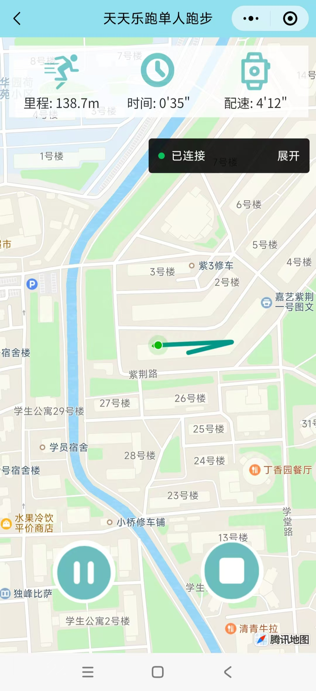

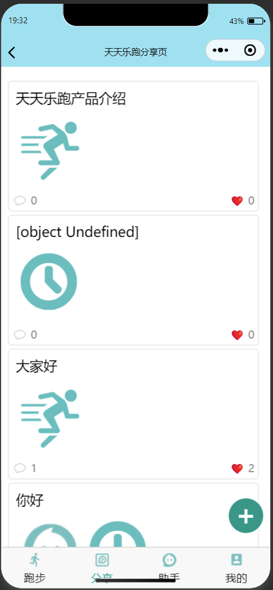
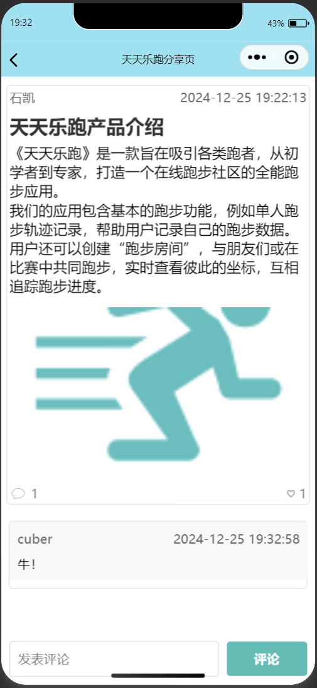
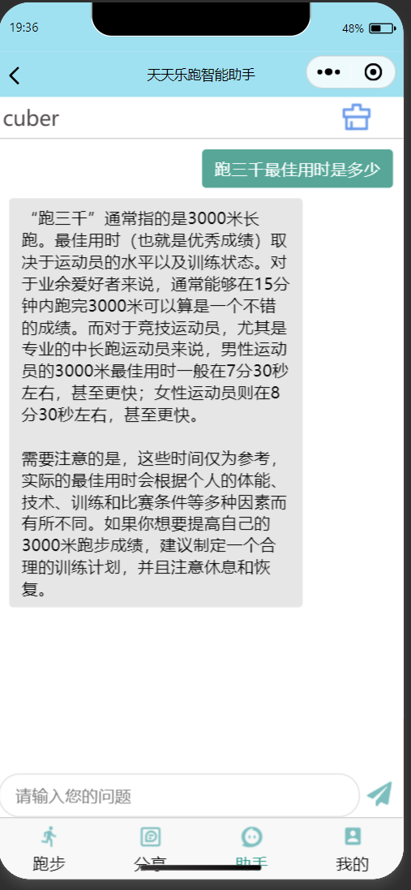
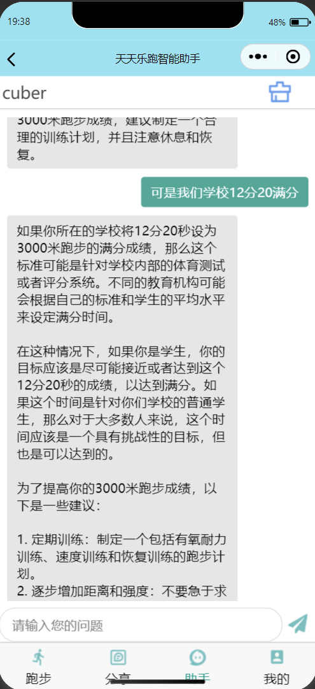

### 6.2 性能测试

性能测试主要关注真实场景中使用流畅度、各机型使用场景、内存占用、并发支持等方面。测试方法包括真机调试、模拟器低端机型测试、内存占用分析、API性能测试等。

#### 结果分析
- **真机调试**：
  - 在我们小组成员的真机调试中发现，本产品的操作流畅度较好，响应较快。唯一影响体验的功能是AI助手聊天回复速度，但基本在3000ms内可以响应，影响不大。这个测试主要用于评估用户在不同网络环境下的实际体验，通过多次调试验证了应用的稳定性和快速响应能力。
- **模拟器低端机型测试**：
  - 在开发者工具模拟器中测试了包括iPhone5、Nexus5等老机型，结果表明页面实时帧率稳定在60fps，性能评分无明显差别。此测试旨在验证应用在不同性能的设备上的表现，确保即使在低端设备上也能流畅运行。
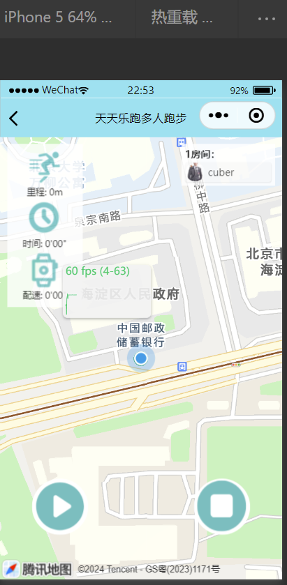
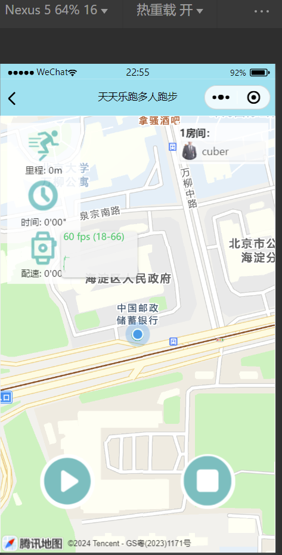
  
- **开发者工具性能与内存占用分析**：
  - 模拟用户操作访问所有页面，得到的性能表现结果和内存占用结果显示，程序效应没有明显延迟，内存占用保持稳定，无内存泄漏导致的卡死问题。通过分析内存占用情况，确认应用在长时间使用后不会出现内存泄漏或性能下降的问题。
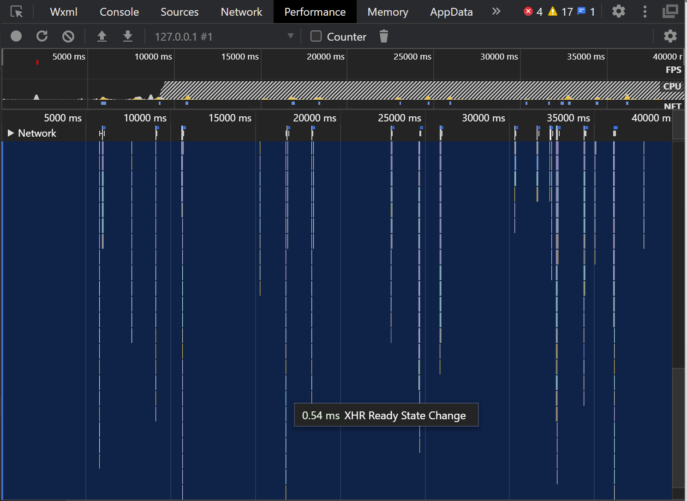
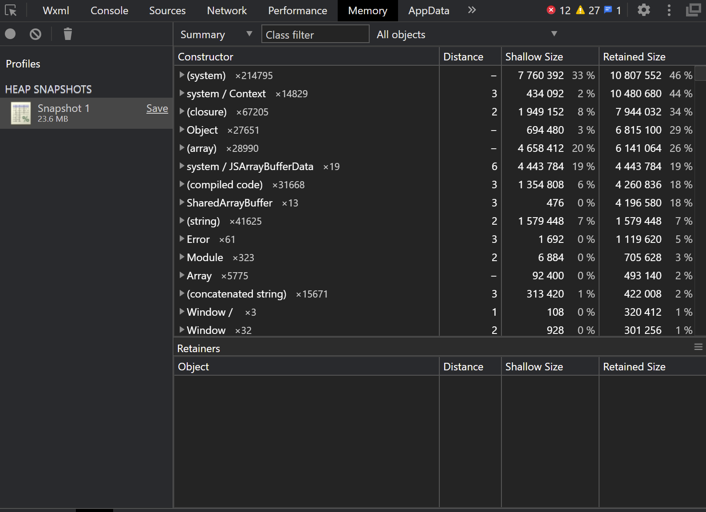
- **开发者工具Audits 评分**：
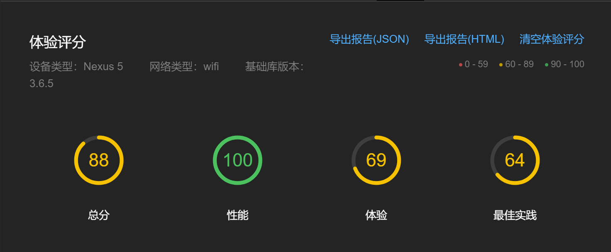
- **API性能与并发请求测试**：
  - 通过Apifox性能测试工具，对后端API接口进行了高并发请求测试，平均请求耗时为100ms左右，显示小程序服务具有良好的性能表现。这个测试评估了后端服务在高并发情况下的稳定性和响应速度，确保能支持大规模用户同时使用。
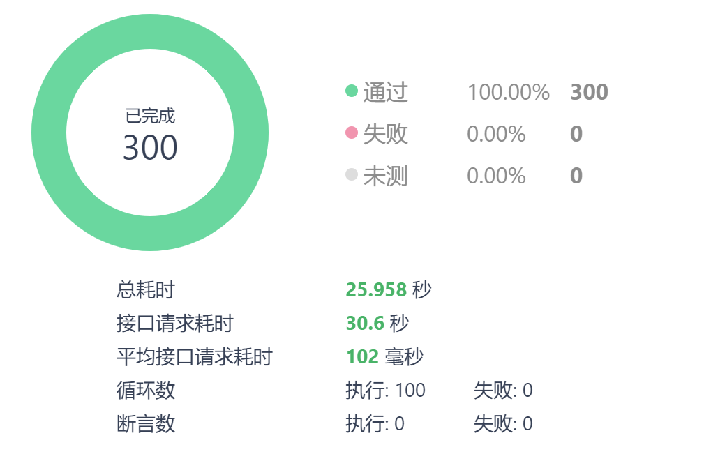

### 6.3 后端API单元测试

后端API单元测试分为基础功能、用户设置与运行数据、多人跑步、论坛和删除数据库等模块，确保各模块功能独立、有效运行。

1. **基础功能（Basic Functions）**
   - 测试核心API接口（如用户登录、注册、获取公共数据等），确保其正确返回数据并处理错误情况。通过详细的测试用例验证各项基础功能在不同场景下的表现，包括无效请求和异常处理。
2. **用户设置与运行数据（User Settings & Running Data）**
   - 测试用户相关API（如设置个人资料、修改密码、查询用户运动记录等），确保接口根据不同的用户信息和请求参数返回正确结果。重点测试数据的准确存储与更新，验证数据一致性。
3. **多人跑步（Group Running）**
   - 测试与多人跑步活动相关的API接口（如创建跑步活动、加入跑步活动、获取参与者列表等），确保接口在不同参与人数和活动场景下的稳定性。通过模拟不同用户的交互，验证活动管理和数据同步的准确性。
4. **论坛（Forum）**
   - 测试论坛相关API接口（如发布帖子、评论、点赞等），确保用户互动功能正常，并处理各种异常情况。详细验证各类用户操作的响应速度和准确性。
5. **删除数据库（Database Deletion）**
   - 测试与数据库删除相关的API接口，确保删除操作的安全性和数据一致性，不影响其他模块正常运行。验证数据删除操作的可靠性，确保不会导致系统故障或数据丢失。

### 6.4 后端API自动化测试

本文档详细说明了如何通过Jest测试框架对后端API进行全面自动化测试，涵盖用户认证、跑步活动、社交帖子和多用户跑步空间等核心功能。

#### 自动化执行与GitHub Actions集成
- 将自动化测试与GitHub Actions集成，确保每次提交都能自动触发测试运行，并即时反馈代码质量，避免潜在问题积累。通过持续集成的方式，确保每次代码变更都经过严格测试，提高代码质量。

#### 测试覆盖率指标
- 语句覆盖率：80.86%
- 函数覆盖率：89.58%
- 代码行覆盖率：80.86%

这些覆盖率指标表明，测试涵盖了代码的大部分逻辑，能够有效发现潜在的代码缺陷。

#### 测试架构使用的技术
- **Jest测试框架**：提供强大的功能和清晰的报告，便于测试用例的编写和结果分析。
- **Supertest**：用于API请求的HTTP断言，确保每个请求的返回值符合预期，方便测试API接口。
- **MongoDB/Mongoose**：用于模拟实际的数据库操作，验证数据存储与处理的正确性。
- **Express.js**：用于API路由管理，确保API请求能够正确路由和处理。

#### 测试类别
1. **用户管理测试**
   - 覆盖用户注册、身份验证、个人资料管理、用户设置等。详细验证用户管理功能的各项操作，确保用户数据的安全和完整。
2. **跑步活动测试**
   - 确保当前跑步数据管理、跑步记录创建与检索、性能指标计算等功能完整性。重点测试数据的实时性和准确性，确保用户能够获得正确的跑步数据。
3. **社交帖子系统**
   - 测试帖子创建、图片上传、评论功能、点赞系统、帖子检索和筛选等。验证用户互动功能的完整性和响应速度，确保用户体验顺畅。
4. **多用户跑步空间**
   - 测试空间创建管理、用户加入/离开机制、位置更新、跑步者状态同步等。详细验证多人互动功能的准确性和实时性，确保用户能够顺利参与多人跑步活动。

### 总结
我们的自动化测试框架覆盖了用户认证、跑步活动、社交帖子和多用户跑步空间等所有重要功能，并通过GitHub Actions与持续集成实现每次提交时的自动测试，确保API的高可用性与高可靠性，为产品的稳定性和用户体验提供保障。通过详细的测试用例和自动化测试流程，我们能够及时发现并修复潜在问题，确保产品在各种场景下的稳定性和可靠性。
